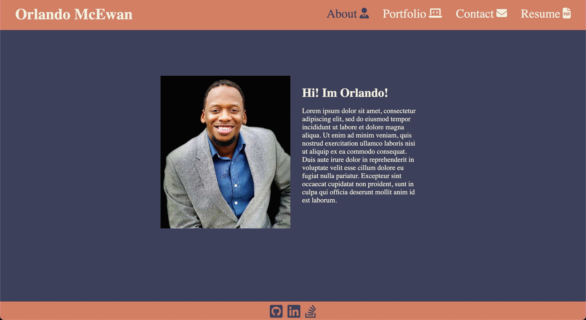

# Orlando's React Portfolio

## Description
Orlando's React Portfolio is a single page application (SPA)  developed with React and was designed to showcase my skills and qualification as an up coming web developer. The application was also developed to practice and improve my ability to use React as a front end framework. The deployed application can be viewed at https://omcewan.github.io/react-portfolio/.

## Built With
 * JavaScript
 * React
 * CSS
 * Node

## ScreenShot

## Questions
For additional information about the project, please find it at the following www.github.com/omcewan.
Also if you have additional questions please contact me at orlandomcewan231@gmail.com.
